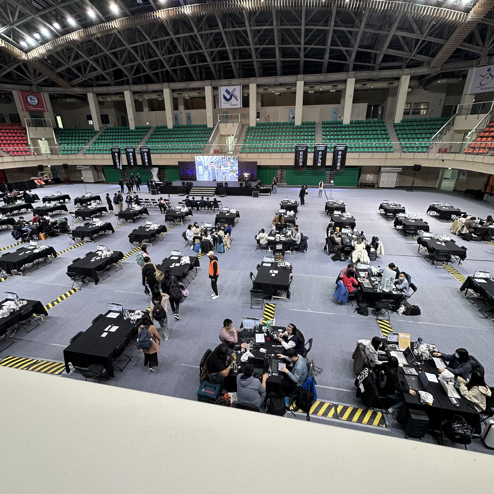
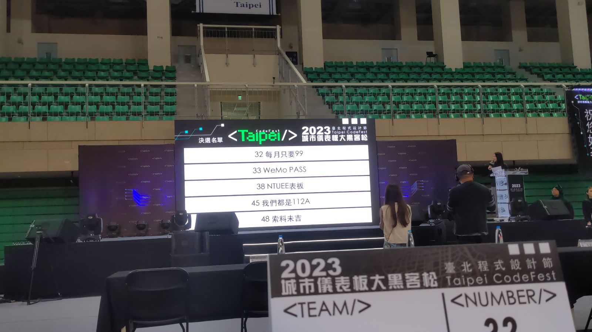
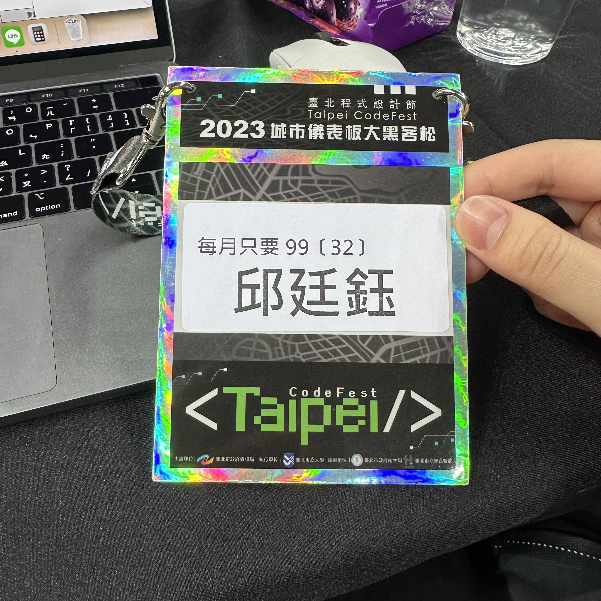
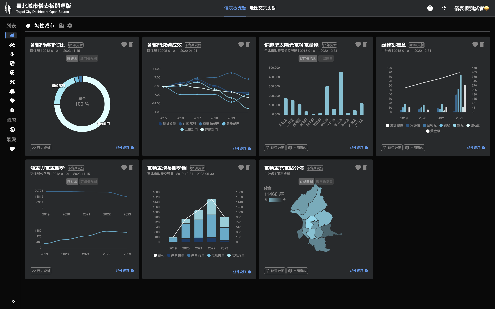
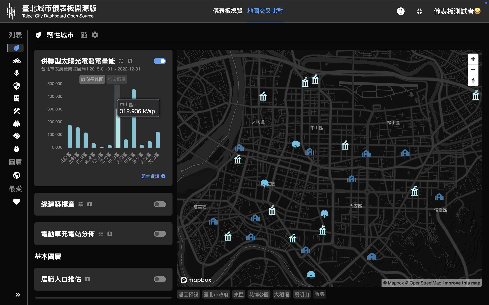
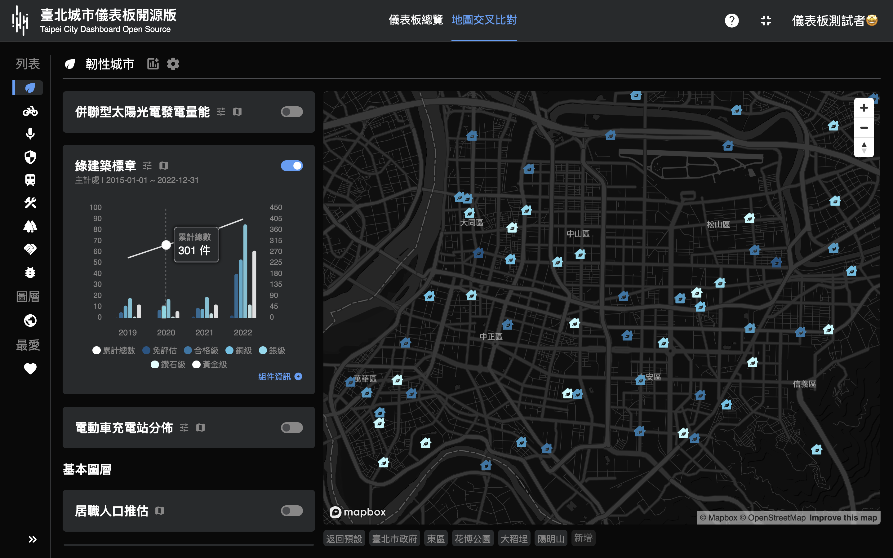
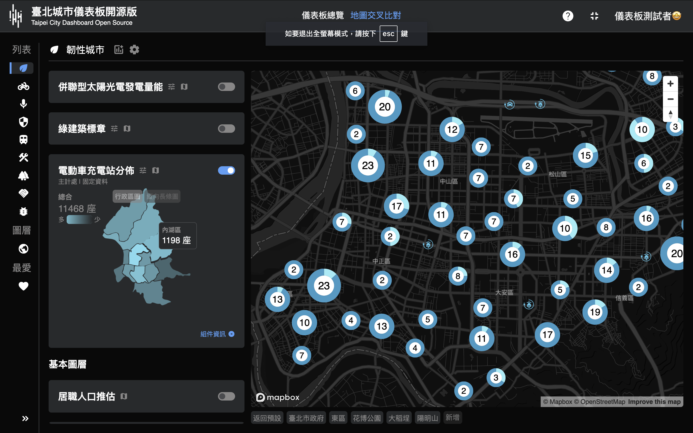

# 2023 Taipei CodeFest 臺北程式設計節城市儀表板黑客松參賽紀錄 - 每月只要 99

2023/11/18~19，受到在 WeMo 的朋友邀約與他們一同組隊參賽黑客松，這項活動歷時 32 小時，並且需要事前針對黑客松的程式碼與主題進行研究與討論，最終在六大主題中，我們隊伍選擇「韌性都市」為我們隊伍的主題，並取名 WeMo 的訂閱方案為隊伍名稱「每月只要 99」。

我們的隊伍有進入到最終決選，但可惜沒有獲得名次或是佳作，但這次的看到很多很厲害的作品，也接觸到一些工作上不會遇到的專案，讓我覺得受益良多。

下面是我們的成品：

